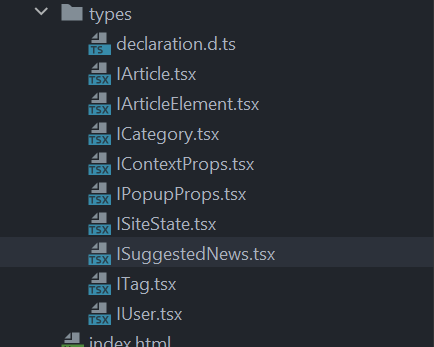
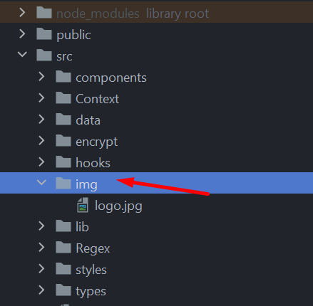
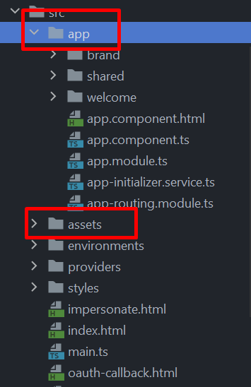

1. Придерживайся одной стилистики названия директорий (либо все с большойЮ либо все с маленькой) 
2. В названии файлов не надо указывать приставку I, достаточно обычного имени. + если в файлах интерфейсы которые
   связаны с одной сущностью, можно держать их в одном файле. Например, у тебя IArticle и IArticleElement оба связаны с
   article, можно их поместить в файл Article.tsx.  
3. наверное нет смысла использовать tsx файлы для интерфейсов. Достаточно обычного ts
4. Все ассеты: картинки, шрифты и прочее должны лежать в директории assets, причем она должна лежать не вместе с кодом,
   а на уровень выше 
   Вот пример из ангуляра 
5. Не забывай точки с запятой в конце строк, мыж не питонисты
6. Очень много строк типа  // eslint-disable-next-line. Не надо так, eslint не просто так ругается, надо фиксить проблемы, а не игнорировать их 
